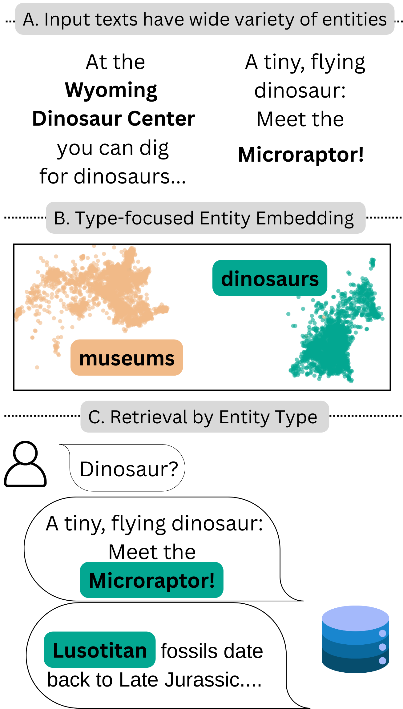
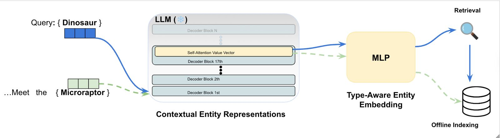

# NER Retriever: Zero-Shot Named Entity Retrieval with Type-Aware Embeddings

This is the official repository of the paper NER Retriever, where a user-defined type
description is used to retrieve documents mentioning entities of that type. 
This repository explains the data pipeline described in the paper.

For example, If the user would like to retrieve all documents containing a dinosaur,
all documents containing a name of a dinosaur of any kind would be retrieved.

The data is kept both with embedding and textual, so kNN / BM25 / hybrid could all be used. 

The workflow of NER Retriever contains three parts:

1. **Entity Detection Phase** – `entity_detection_phase_fewnerd.py`
   detects the entities in Few-NERD dataset.
   Using `CascadeNER/models_for_CascadeNER` LLM via
   `cascade_llm_entity_extractor.py`,  we mark named entities and locate them in the sentence. 
   An evaluation of entities detection is also performed. 
2. **Indexing Phase** – `indexing_phase.py`
    generates the embedding from textual representation, and stores them to a binary file.
    The LLM we use is Llama 3.1 8B, as well as a small contrastive projection head (MLP) specifically designed for this task (exhaustive retrieval).
3. **Retrieval Phase** – `retrieval_phase.py`
   loads the indexed dataset and retrieves the entity types defined in the dataset. 
   REMINDER! none of the LLMs nor the contrastive projection head was trained on Few-NERD dataset, demonstrating schema free retrieval. 
    

For more information, read the paper attached to this repository. 

Typical usage:

    python entity_detection_phase_fewnerd.py
    python indexing_phase.py
    python retrieval_phase.py

Each script provides `--help` for additional options.
Please note! 
In order to utilize Llama 3.1 from Hugging Face, a permission to the llm is required, 
and a valid token from Hugging Face will be asked during the process.